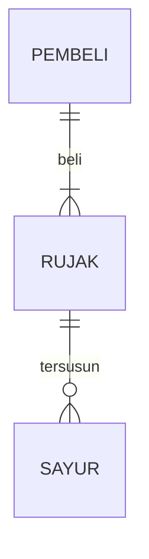

## 1.1 Latar Belakang
latar belakang saya bikin game pukul tikus tanah ini selain dari nostalgia dari game yang suka ada di tempat wahayana game, selain itu sebagai edukasi khususnya kepada anak-anak yang manfaatnya untuk : 
konsentrasi dan reaksi cepat yang bermanfaat bagi perkembangan otak anak-anak
memerhatikan kedetailan dan ke fokusan secara cermat terhadap tikus yang muncul
melatih kesabaran dan konsentrasi
melatih keputusan secara cepat

## 1.2. Deksripsi Teknologi Informasi

Game ini berguna untuk melatih keterampilan anak-anak agar dapat berkonsentrasi,
berfikir cepat, serta melatih kesabaran 
tidak hanya itu game ini juga baik terhadap perkembangan otak anak- anak
karena dalam fase ini otak sensorik anak masih sensitif dan mudah untuk meyerap apa yang di tangkap oleh mata.
sehingga Game ini berguna untuk melatih kesabaran ,serta berfikir cepat.

## 1.3. Branding

Merk : Game Pukul Tikus Tanah
Tagline : Bermain game yang seru dan menanrik untuk di coba
campaign : Mari bermain Game pukul tikus tanah dimanapun dan kapan pun tanapa repot pergi ke Mall wahana Permainan.

## 2. User Story

SEBAGAI | SAYA INGIN| SEHINGGA SAYA |
---|--- |---|---
PENGGUNA | BERMAIN | MENDAPATKAN POIN| ⭐⭐⭐⭐⭐

## 3. Struktur Data

Cara membuat aneka macam bentuk grafik menggunakan mermaid.js bisa lihat di [https://mermaid.js.org/syntax/entityRelationshipDiagram.html](https://mermaid.js.org/syntax/entityRelationshipDiagram.html) 

## 4. Arsitektur Sistem

Masih pake mermaid.js juga bisa lihat flowchart di [https://mermaid.js.org/syntax/flowchart.html](https://mermaid.js.org/syntax/flowchart.html)

## 5. Teknologi, Library, dan Framework

bla bla bla

## 6. Desain User Experience dan User Interface

Bisa load image 
https://www.canva.com/design/DAFzNfku64c/ec6P6_srNvggSuupL_xgJw/view?utm_content=DAFzNfku64c&utm_campaign=designshare&utm_medium=link&utm_source=editor
## 7. Demonstrasi Video

Link youtube nya

## 8. Bagaimana mesin komputasi dan sistem operasi berperan dalam produk teknologi informasimu ?

Link youtube nya di detik jawaban ini

## 9. Bagaimana algoritma, struktur data, dan bahasa pemrograman berperan dalam produk teknologi informasimu ?

Link youtube nya di detik jawaban ini

## 10. Bagaimana metode pengembangan perangkat lunak / Software Development Life Cycle berperan dalam produk teknologi informasimu ?

Link youtube nya di detik jawaban ini

## 11. Bagaimana database / sistem basis data berperan dalam produk teknologi informasimu ?

Link youtube nya di detik jawaban ini
